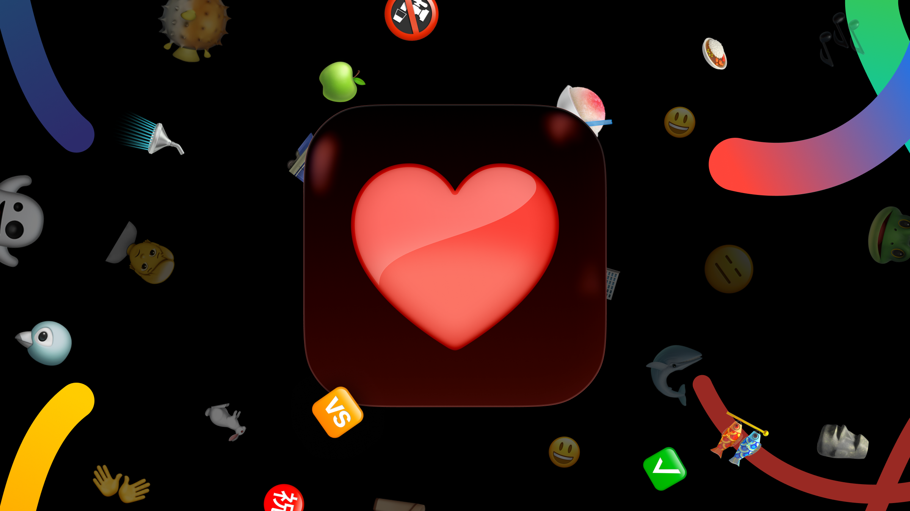

  

<h1 align="center">Haptics</h1>

Send love your friends can actually feel.

  
  

Haptics is an iOS app for lightweight tactile communication. You can send a quick vibe, drop an emoji, sketch live, or ping someone from the Home Screen widget when words feel like too much.

Read more in the launch post: [Haptics Goes Open Source](https://www.spottedinprod.com/blog/haptics-goes-open-source).

## Highlights

- Wave shocks and haptics
- Emoji Fall
- Drawing
- Home Screen widget for quick check-ins

## Getting Started

See [RUNNING.md](RUNNING.md) for the full local setup flow, including Firebase project creation, app configuration, signing, and backend setup.

## Architecture

Haptics uses an MVVM-style architecture with dependency injection, a session pattern for shared state, centralized routing, and a modular local Swift package setup. The app is built with UIKit and backed by Firebase.

## Acknowledgments

- [Firebase](https://github.com/firebase/firebase-ios-sdk)
- [MCEmojiPicker](https://github.com/izyumkin/MCEmojiPicker)
- [PinLayout](https://github.com/layoutBox/PinLayout.git)
- [swift-dependencies](https://github.com/pointfreeco/swift-dependencies)

Dependency and license metadata is generated with [swift-package-list](https://github.com/FelixHerrmann/swift-package-list).

Full dependency and license inventory, including transitive packages, can be found in [Haptics/Resources/Settings.bundle](Haptics/Resources/Settings.bundle).

## License

This project is licensed under the Apache License 2.0. See [LICENSE](LICENSE) for details.
